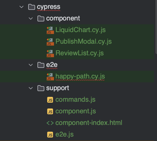
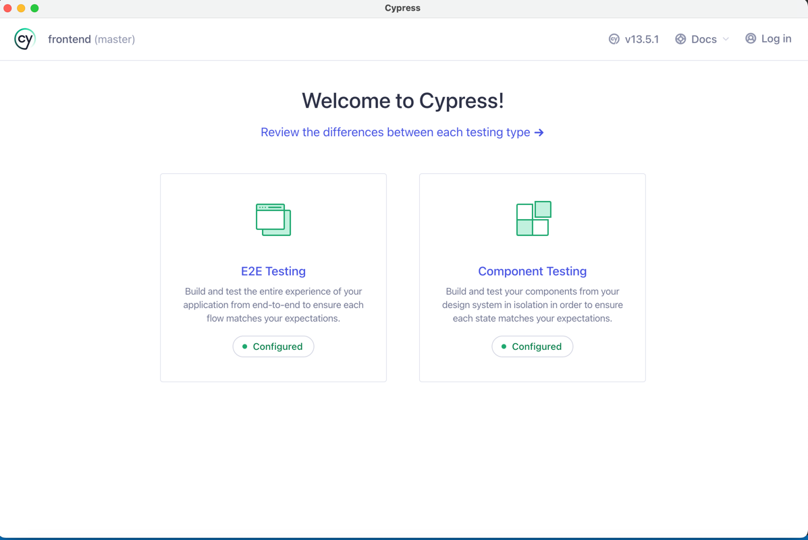

1. In this project, I use Cypress to complete the UI test and component test.

2. Start the backend and frontend
3. Open terminal in the frontend folder and run `npm run test`
4. Click the E2E test to start UI test and click the component test to start component test
